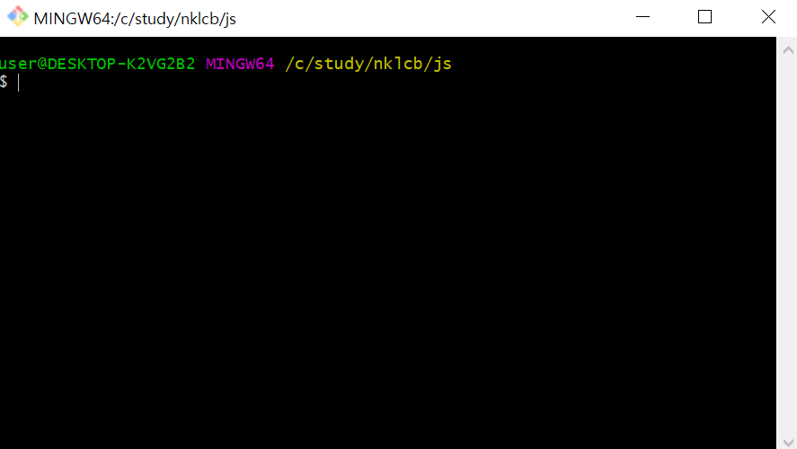
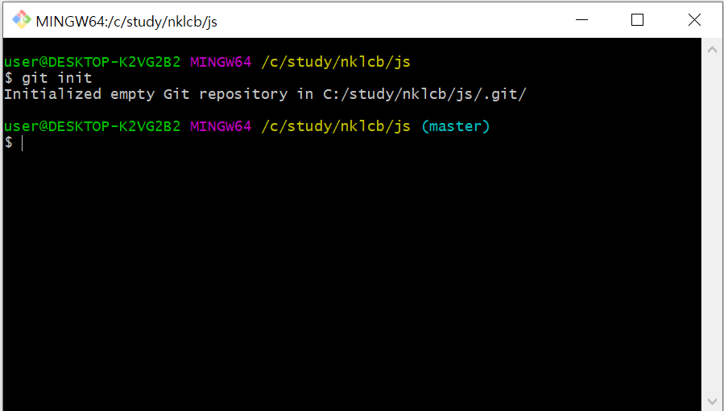
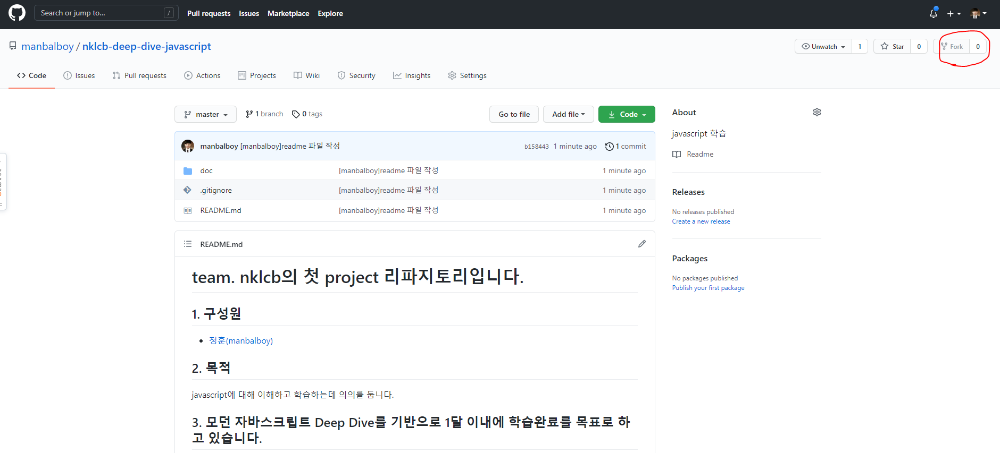

# repository 생성 

1. C:/study/nklcb/js/ 를 생성한다.
2. 마우스 우 클릭 후 git bash 를 띄운다.
   
3. 다음 명령어를 입력하여 git 폴더를 활성화 한다. 
   ```bash
   git init
   ```

   
4. [https://github.com/manbalboy/nklcb-deep-dive-javascript.git](https://github.com/manbalboy/nklcb-deep-dive-javascript.git) 를 접속하여 fork 버튼을 클릭한다.
    
5. git remote add origin https://github.com/GITHUBID/nklcb-deep-dive-javascript.git 명령어로 원격지를 추가한다. **자기리파지토리주소**

